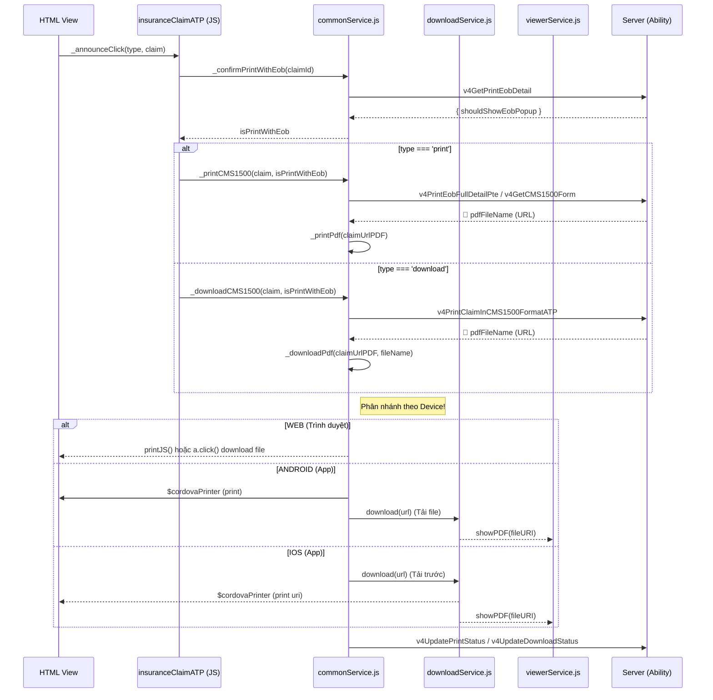

# ĐIỀU TRA WORKFLOW: PRINT & DOWNLOAD (INSURANCE CLAIM MANAGEMENT)

Tài liệu này truy vết luồng hoạt động của tính năng _Print_ và _Download PDF_ của CMS1500 trong màn hình quản lý bảo hiểm:
`d:\Sources\pteverywhere\Client\app\views\insuranceSettingModule\claimManagement\insuranceClaimManagementATP.html`.

Đây là nhánh logic riêng dành cho màn hình Quản lý tập trung, chia sẻ thư viện chung qua `commonService.js` nhưng entry point từ Controller `insuranceClaimManagementATP`.

---

## 📊 1. Luồng chạy tổng quan (Flowchart)


---
=============================================================================
         🖨️ TRUY VẾT WORKFLOW: PRINT & DOWNLOAD INSURANCE CLAIM
=============================================================================

[1. TỪ GIAO DIỆN HTML]
   📍 insuranceClaimManagementATP.html
   ├── 🖱️ Nút Print:    ng-click="announceClick('print', claim.data)"
   └── 🖱️ Nút Download: ng-click="announceClick('download', claim.data)"
             │
             ▼
[2. VÀO XỬ LÝ Ở CONTROLLER]
   📍 insuranceClaimManagementATP.js  
   👉 Function: _announceClick(type, claim)
             │
             ├── Gọi: commonService.confirmPrintWithEob(claimId) 
             │   (Hỏi server xem có cần hiển thị popup chọn EOB không)
             │
             ├── [RẼ NHÁNH TỪ TỪ KHÓA] ──────────────┐
             │                                       │
      (Nếu type = 'print')                 (Nếu type = 'download')
      👉 Gọi: print1500()                   👉 Gọi: download1500()
             │                                       │
             ▼                                       ▼
[3. XUỐNG DỊCH VỤ DÙNG CHUNG]
   📍 commonService.js 
   👉 _printCMS1500()                        👉 _downloadCMS1500()
             │                                       │
             ├── Lấy link từ Server                  ├── Lấy link từ Server
             │   (API: v4PrintEobFullDetailPte /     │   (API: v4PrintClaimInCMS1500FormatATP)
             │    v4GetCMS1500Form)                  │
             │                                       │
             ├── [BẮT ĐẦU IN - _printPdf]            ├── [BẮT ĐẦU TẢI - _downloadPdf] 
             │                                       │
             ▼                                       ▼
[4. RẼ NHÁNH THEO THIẾT BỊ (NỀN TẢNG)] ====== (Cực kỳ quan trọng) ======

   🌐 4.1. NẾU LÀ WEB (Trình duyệt)
      ├── Print:    Chạy thư viện printJS({ printable: pdfUrl ... }) đẻ mở popup in.
      └── Download: Dùng HTML (thẻ <a download>) để tải tệp PDF về máy tính.

   🤖 4.2. NẾU LÀ ANDROID (App)
      ├── Print:    Gọi thẳng `$cordovaPrinter.print(pdfUrl)` (Android < 10 hỗ trợ).
      └── Download: Dùng `downloadService.download` tải PDF vào vùng nhớ đệm, sau đó 
                    gọi `viewerService.showPDF(fileURI)` để mở xem.

   🍏 4.3. NẾU LÀ IOS (App)
      ├── Giải thích: iOS bảo mật nghiêm ngặt, KHÔNG cho xem/print thẳng từ link AWS S3.
      ├── Print & Download BẮT BUỘC: 
      │   1️⃣ Gọi `downloadService.download` tải PDF về thư mục nội bộ (syncedDataDirectory).
      │   2️⃣ Có file nội bộ (fileURI) rồi mới bắt đầu:
      │       - Print: Gọi `$cordovaPrinter.print(fileURI)`
      │       - Download: Gọi `viewerService.showPDF(fileURI)`
      │
      ▼
[5. KẾT THÚC CẬP NHẬT TRẠNG THÁI]
   📍 commonService.js
   👉 Cập nhật server: _updateStatusAndPrintInfo() Hoặc _updateStatusAndDownloadInfo()


---

## 🔍 2. Dấu vết cụ thể từng dòng mã (Line-by-Line Trace)

### 📌 Giai đoạn 1: Bấm nút trên giao diện (UI)
**File:** `d:\Sources\pteverywhere\Client\app\views\insuranceSettingModule\claimManagement\insuranceClaimManagementATP.html`
*   **Print (Dòng ~399):** 
    ```html
    <md-button ng-click="announceClick('print',claim.data)">{{::'Common.Print' | translate}}</md-button>
    ```
*   **Download (Dòng ~405):**
    ```html
    <md-button ng-click="announceClick('download',claim.data)">{{::'Common.DownloadPDF' | translate}}</md-button>
    ```

### 📌 Giai đoạn 2: Tiếp nhận ở Controller
**File:** `d:\Sources\pteverywhere\Client\app\scripts\controllers\insuranceSettingModule\insuranceClaimManagementATP.js`
*   **Dòng ~3799:** Hàm `_announceClick(type, claim)` tiếp nhận request.
*   **Dòng ~3804:** Gọi `commonService.confirmPrintWithEob` để kiểm tra có cần hiển thị popup hỏi User có muốn in kèm EOB hay không.
*   **Dòng ~3809:** Dựa vào `type`, rẽ nhánh switch/case:
    *   `print`: Gọi hàm `print1500(claim, isPrintWithEob)` **(Dòng 3749)**
    *   `download`: Gọi hàm `download1500(claim, isPrintWithEob, isDownloadForFaxing)` **(Dòng 3756)**
    *   Cả hai hàm này sẽ gọi thẳng vào service tương ứng là `commonService.printCMS1500` và `commonService.downloadCMS1500`.

### 📌 Giai đoạn 3: Xử lý logic tại commonService.js 
**File:** `d:\Sources\pteverywhere\Client\app\scripts\service\commonService.js`

**Trường hợp Print:**
*   **Dòng ~961:** `function _printCMS1500(claim, isPrintWithEob)`
    *   Nếu in kèm EOB: Gọi server lấy file (API `v4PrintEobFullDetailPte`).
    *   Nếu in thường: Gọi `_getCMS1500Form` lấy URL CMS mặc định.
    *   Tiến hành gọi `_printPdf(claimUrlPDF)` **(Dòng ~1040)**.
    *   Cập nhật trạng thái in: `_updateStatusAndPrintInfo(claim._id)`.

**Trường hợp Download:**
*   **Dòng ~1094:** `function _downloadCMS1500(claim, ...)`
    *   Gọi `_getPDFFileFromAbility` lấy URL PDF.
    *   Gọi `_downloadPdf(claimUrlPDF, fileName)` . *(Hàm này nằm ngay dưới _downloadCMS1500 nhưng trong code hiện tại của project được define cục bộ).*
    *   Cập nhật trạng thái tải: `_updateStatusAndDownloadInfo(claim._id)`.

---

## 📱 3. Phân nhánh xử lý theo thiết bị (Platform Logic)

Luồng kết thúc phụ thuộc vào thiết bị (nằm ở `_printPdf` và `_downloadPdf` trong `commonService.js`):

### ✅ Case THÀNH CÔNG:

#### 1. Môi trường WEB:
*   **Print:** Dùng thư viện `printJS({ printable: pdfUrl, type: "pdf" })` đẻ mở popup in.
*   **Download:** Dùng DOM HTML (`a.click()`) hoặc `xhr` tải blob và save file trực tiếp xuống máy tính.

#### 2. Môi trường ANDROID (App):
*   **Print:** `cordovaPrinter` chỉ support Android < 10. Chạy code `$cordovaPrinter.print(pdfUrl)`.
*   **Download:** 
    *   Gọi hàm ở `downloadService.js` (Dòng 44): Tải PDF về lưu tại `cordova.file.dataDirectory`.
    *   Download thành công -> Chuyển filePath (dạng `nativeURL`) cho `viewerService.showPDF(fileURI)` (Dòng ~25). Dùng `fileOpener2` mở PDF.

#### 3. Môi trường IOS (App):
*   **Print & Download:** Vì iOS rất nghiêm ngặt, URL S3 không thể print/view trực tiếp.
    *   Bắt buộc chạy qua `downloadService.js` tải file về `syncedDataDirectory`.
    *   Sau khi tải xong tạo ra local `fileURI`. 
    *   Nếu *Print*: Gọi `$cordovaPrinter.print(fileURI)`
    *   Nếu *Download*: Gọi cho `viewerService.showPDF(fileURI)`

### ❌ Case THẤT BẠI:
*   **Lỗi từ Server:** Hàm `_getPDFFileFromAbility(...)` nhận API error. `commonService.js` bắt lỗi cục bộ và gọi `_showErrorMessageFromAbility(errorCode)` **(Dòng ~425)** hiện hộp thoại cảnh báo: _"Claim does not exist"_, _"Could not connect to Ability"_.
*   **Lỗi Download trên App:** Hàm `downloadService.download` reject error do không đủ quyền Storage, hoặc máy hết bộ nhớ -> Hiện alert catch tại view.
*   **Lỗi in:** Người dùng thiết bị Android 10+ (không tương thích SDK cũ của `$cordovaPrinter`) bấm vào nhưng không có phản hồi.
