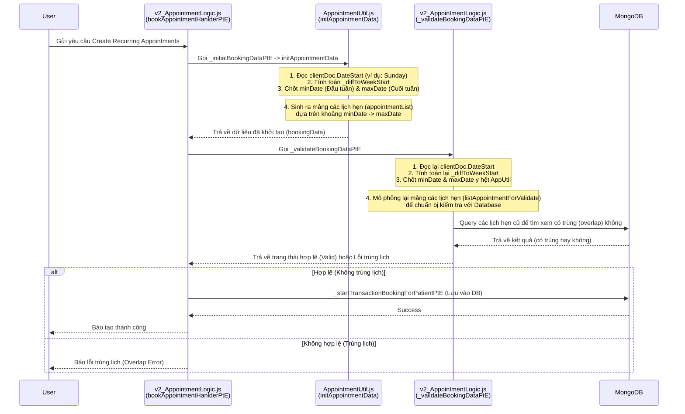

Searched for "bookAppointmentHanlderPtE"
Searched for "bookAppointmentHanlderPtE"
Searched for "_diffToWeekStart"
Searched for "_diffToWeekStart"
Viewed AppointmentUtil.js:601-1400
Viewed v2_AppointmentLogic.js:17601-18400

Dưới đây là phần phân tích chi tiết và sơ đồ workflow cho bug "Create Recurring Appointments" đi qua 2 file mà bạn đang debug.

### 1. Sơ đồ Workflow (Luồng chạy của Bug)

Sơ đồ này mô tả cách luồng dữ liệu đi qua 2 file khi user bấm tạo một lịch hẹn lặp lại (Recurring Appointment):

### 2. Giải thích tại sao cần sửa cả 2 file với code giống hệt nhau?

Khi hệ thống xử lý tính năng "Tạo lịch hẹn lặp lại", nó chia làm 2 nhiệm vụ riêng biệt (nằm ở 2 hàm khác nhau):

1. **Nhiệm vụ Sinh Dữ Liệu (Generator) - nằm ở `AppointmentUtil.js (initAppointmentData)`:**
   - Hàm này chịu trách nhiệm **tạo ra** các bản ghi (objects) lịch hẹn thực tế sẽ được lưu vào cơ sở dữ liệu.
   - Nó cần biết chính xác ngày đầu tuần của Clinic (`DateStart`) để xác định `minDate` và `maxDate`. Từ đó, vòng lặp `while (minDate <= maxDate)` mới quét đúng các ngày trong tuần mà user đã chọn (ví dụ chọn thứ 3, thứ 5) để sinh ra đúng ngày.

2. **Nhiệm vụ Kiểm Tra Hợp Lệ (Validator) - nằm ở `v2_AppointmentLogic.js (_validateBookingDataPtE)`:**
   - Hàm này chịu trách nhiệm **kiểm tra xem** các ngày chuẩn bị lưu có bị trùng với lịch đã có trong DB hay không, hoặc có bị rơi vào Block Time của bác sĩ hay không.
   - Để làm được việc đó mà không làm ảnh hưởng (mutate) mảng dữ liệu gốc, hàm này **tự động mô phỏng (tái tạo) lại** một mảng lịch hẹn tạm thời (`listAppointmentForValidate`). 
   - Vì nó phải mô phỏng lại y hệt quá trình sinh dữ liệu, nó CŨNG CẦN phải biết chính xác ngày đầu tuần (`DateStart`), `minDate` và `maxDate`.

**💡 Kết luận:** 
Nếu bạn chỉ sửa ở **Generator** (`AppointmentUtil.js`) mà quên sửa ở **Validator** (`v2_AppointmentLogic.js`), hệ thống sẽ tạo ra ngày đúng, nhưng lại mang một tập ngày **sai** đi kiểm tra trùng lịch. Dẫn đến việc hệ thống có thể cho phép lưu một lịch bị trùng, hoặc báo lỗi trùng lịch ảo (false positive) ở những ngày không hề có lịch. Do đó, logic tính toán `minDate` và `maxDate` buộc phải đồng nhất ở cả 2 nơi.