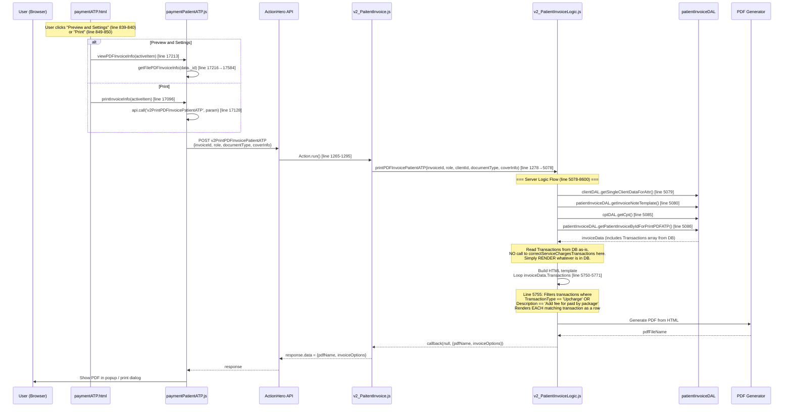

# PTE-6419: Duplicate "Add fee for paid by package" Ledger

## Part 1: Print PDF Invoice Workflow

### 1.1 Complete Request Flow Diagram



### 1.2 Key Code References

| Step | File | Line | Function/Code |
|------|------|------|---------------|
| **Click Preview** | [paymentATP.html](file:///d:/Sources/pteverywhere/Client/app/views/patientDashboard/paymentATP.html#L839-L840) | 839-840 | `ng-click="viewPDFInvoiceInfo(activeItem)"` |
| **Click Print** | [paymentATP.html](file:///d:/Sources/pteverywhere/Client/app/views/patientDashboard/paymentATP.html#L849-L850) | 849-850 | `ng-click="printInvoiceInfo(activeItem)"` |
| **viewPDFInvoiceInfo** | [paymentPatientATP.js](file:///d:/Sources/pteverywhere/Client/app/scripts/controllers/patientDashboard/paymentPatientATP.js#L17213) | 17213 | Calls `getFilePDFInvoiceInfo()` → opens Preview dialog |
| **printInvoiceInfo** | [paymentPatientATP.js](file:///d:/Sources/pteverywhere/Client/app/scripts/controllers/patientDashboard/paymentPatientATP.js#L17096) | 17096 | Calls API directly → triggers browser print |
| **getFilePDFInvoiceInfo** | [paymentPatientATP.js](file:///d:/Sources/pteverywhere/Client/app/scripts/controllers/patientDashboard/paymentPatientATP.js#L17584-L17609) | 17584 | `api.call('v2PrintPDFInvoicePatientATP', params)` |
| **Server Action** | [v2_PaitentInvoice.js](file:///d:/Sources/pteverywhere/Server/actions/v2_PaitentInvoice.js#L1265-L1295) | 1265 | Routes to `api.v2_patientInvoice.printPDFInvoicePatientATP()` |
| **Server Logic** | [v2_PatientInvoiceLogic.js](file:///d:/Sources/pteverywhere/Server/logicMongo/v2_PatientInvoiceLogic.js#L5078) | 5078 | Read-only: fetches invoice data + generates PDF HTML |
| **Render Upcharge** | [v2_PatientInvoiceLogic.js](file:///d:/Sources/pteverywhere/Server/logicMongo/v2_PatientInvoiceLogic.js#L5750-L5771) | 5750-5771 | Loops ALL matching transactions → renders each as HTML row |

---

## Part 2: Root Cause Analysis

### 2.1 Anh đúng — `correctServiceChargesTransactions` KHÔNG nằm trong Print flow

> [!IMPORTANT]
> Hàm `printPDFInvoicePatientATP` (line 5078-8600) là **READ-ONLY**. Nó chỉ đọc `invoiceData.Transactions` từ DB và render thành HTML. Nó **KHÔNG gọi** `correctServiceChargesTransactions`.

### 2.2 Vậy `correctServiceChargesTransactions` được gọi ở đâu?

Hàm `correctServiceChargesTransactions` (line 26306) được gọi tại **2 nơi** — cả hai đều nằm trong **INVOICE UPDATE flows** (write paths), KHÔNG phải print flow:

| # | Caller | Line | Trigger khi nào |
|---|--------|------|-----------------|
| 1 | [updateNormalPatientInvoiceATP](file:///d:/Sources/pteverywhere/Server/logicMongo/v2_PatientInvoiceLogic.js#L17317) | **17317** | User click **Save** khi **Edit Invoice** (payment_view==3) |
| 2 | [correctServiceCharges](file:///d:/Sources/pteverywhere/Server/logicMongo/v2_PatientInvoiceLogic.js#L26265) → called from [_changeServiceChargesTypeInvoice](file:///d:/Sources/pteverywhere/Server/logicMongo/v2_PatientInvoiceLogic.js#L23127) | **26265** (inside 23127) | Treatment Note CPT thay đổi → auto-recalculate service charges |

### 2.3 Bug Mechanism (Cơ chế tạo duplicate)

```mermaid
flowchart TD
    A["Step 1: Buy Package → Create Package Invoice"] --> B["Step 2: Create Service Invoice"]
    B --> C["Step 3: Apply Package to Service Invoice<br/>(Transaction: IsApplyPackage=true, Type=Other)"]
    C --> D["Step 4: Edit Package Invoice → triggers updateNormalPatientInvoiceATP"]
    D --> E["Step 5: correctServiceChargesTransactions called<br/>(line 17317)"]
    E --> F{"isPaidByPackage(inv)?<br/>(line 26335)"}
    F -->|Yes| G{"amendmentAmount > 0?"}
    G -->|No, amendmentAmount ≤ 0| H["Push NEW fee transaction<br/>Description: 'Add fee for paid by package'<br/>(line 26354-26365)"]
    H --> I["Fee #1 saved to DB ✓"]
    
    I --> J["Step 6: Refund Pay-by-Package"]
    J --> K["Step 7: Apply Package AGAIN"]
    K --> L["Step 8: Edit Package Invoice AGAIN → triggers updateNormalPatientInvoiceATP"]
    L --> M["correctServiceChargesTransactions called AGAIN"]
    M --> N{"isPaidByPackage(inv)?"}
    N -->|Yes| O["Push ANOTHER NEW fee transaction<br/>⚠️ Fee #1 still exists in Transactions!"]
    O --> P["Fee #1 + Fee #2 both in DB → DUPLICATE!"]
    
    P --> Q["Step 9: Print/Preview"]
    Q --> R["printPDFInvoicePatientATP reads ALL transactions<br/>line 5755: filter by Description == 'Add fee for paid by package'<br/>Renders BOTH Fee #1 and Fee #2"]
    R --> S["🐛 Duplicate 'Add fee for paid by package' in PDF"]

    style S fill:#f44,color:white
    style H fill:#ff9800,color:white
    style O fill:#f44,color:white
```



### 2.4 Kết luận Root Cause

> [!CAUTION]
> **Root Cause**: Hàm `correctServiceChargesTransactions` (line 26306) **luôn push transaction mới** vào `inv.Transactions` mà **KHÔNG kiểm tra** transaction cùng loại đã tồn tại hay chưa. Khi invoice bị edit nhiều lần (refund → re-apply → edit lại), mỗi lần gọi đều tạo thêm 1 fee/promotion entry → duplicate.
>
> **Print flow chỉ là nạn nhân** — nó hiển thị trung thực data đã sai từ DB.

---

## Part 3: Fix Bug Plan

### 3.1 Solution Options Analysis

| Option | Approach | Pros | Cons | Trade-off |
|--------|----------|------|------|-----------|
| **A** | Trước khi push, xóa existing fee/promotion transactions cùng loại | Clean, idempotent | Phải handle edge cases (nhiều loại transactions) | ⭐ **Recommended** |
| **B** | Trước khi push, check existing rồi update in-place | Không mất history | Logic phức tạp hơn, có thể miss edge cases | Rủi ro cao hơn |
| **C** | Fix ở print flow: deduplicate khi render | Không đụng write path | Chỉ sửa triệu chứng, data trong DB vẫn sai, các feature khác (Client detail view, reports) vẫn hiển thị duplicate | ❌ Anti-pattern |

### 3.2 Recommended Solution: Option A — Remove-and-Recreate

> [!IMPORTANT]
> **Chiến lược**: Trong `correctServiceChargesTransactions`, trước khi push fee/promotion mới cho `isPaidByPackage`, **loại bỏ** (filter out) tất cả existing transactions có `IsApplyPackage == true` + `TransactionType == 'Other'` + matching `Description`. Sau đó recalculate `Upcharge`/`Discount` và push transaction mới.

#### Tại sao chọn Option A?

1. **Idempotent**: Gọi bao nhiêu lần kết quả đều giống nhau — không duplicate.
2. **Data integrity**: DB luôn chứa đúng 1 fee/promotion entry cho mỗi lần apply package, các report/view khác tự động đúng.
3. **Minimal impact**: Chỉ sửa 1 function (`correctServiceChargesTransactions`), không cần đụng print flow hay client code.
4. **Consistent with existing pattern**: Line 26310-26315 đã có pattern "find existing Amendment → update thay vì tạo mới". Option A mở rộng pattern này cho fee/promotion.

### 3.3 Proposed Changes

#### [MODIFY] [v2_PatientInvoiceLogic.js](file:///d:/Sources/pteverywhere/Server/logicMongo/v2_PatientInvoiceLogic.js#L26306-L26374)

**Before (current code, line 26335-26370):**
```javascript
if (isPaidByPackage(inv)) {
    if (amendmentAmount > 0) {
        var promotion = { /* ... */ }
        inv.Transactions.push(promotion)           // ⚠️ Always push new
        inv.Discount = (inv.Discount || 0) + promotion.TransactionAmount
        inv.AppliedPackageData.Package = ...
        inv.Balance = promotion.NewRemainAmount
    } else {
        var fee = { /* ... */ }
        inv.Transactions.push(fee)                  // ⚠️ Always push new
        inv.Upcharge = (inv.Upcharge || 0) + fee.TransactionAmount
        inv.Balance = fee.NewRemainAmount
    }
}
```

**After (proposed fix):**
```javascript
if (isPaidByPackage(inv)) {
    // PTE-6419: Remove existing fee/promotion for paid-by-package
    // to prevent duplicate entries on re-edit
    const existingPkgFeeIdx = _.findIndex(inv.Transactions, function(txn) {
        return txn.IsApplyPackage
            && txn.TransactionType === 'Other'
            && txn.TransactionMethod === 'Package'
            && (txn.Description === 'Add fee for paid by package'
                || txn.Description === 'Add promotion for paid by package')
    })
    if (existingPkgFeeIdx !== -1) {
        const existingTxn = inv.Transactions[existingPkgFeeIdx]
        // Reverse the old amounts before removing
        if (existingTxn.Description === 'Add fee for paid by package') {
            inv.Upcharge = (inv.Upcharge || 0) - existingTxn.TransactionAmount
        } else {
            inv.Discount = (inv.Discount || 0) - existingTxn.TransactionAmount
            inv.AppliedPackageData.Package = (inv?.AppliedPackageData?.Package || 0) - existingTxn.TransactionAmount
        }
        inv.Transactions.splice(existingPkgFeeIdx, 1)
    }

    if (amendmentAmount > 0) {
        var promotion = {
            TransactionDate : new Date(),
            TransactionType: 'Other',
            Description: 'Add promotion for paid by package',
            TransactionMethod: 'Package',
            TransactionAmountType: 'A',
            TransactionAmount: amendmentAmount,
            RemainAmount : inv.Balance,
            NewRemainAmount : inv.Balance - amendmentAmount,
            CreatedBy : pteConfig.PtESystemUserId,
            IsApplyPackage: true
        }
        inv.Transactions.push(promotion)
        inv.Discount = (inv.Discount || 0) + promotion.TransactionAmount
        inv.AppliedPackageData.Package = (inv?.AppliedPackageData?.Package || 0) + promotion.TransactionAmount
        inv.Balance = promotion.NewRemainAmount
    } else {
        var fee = {
            TransactionDate : new Date(),
            TransactionType: 'Other',
            Description: 'Add fee for paid by package',
            TransactionMethod: 'Package',
            TransactionAmountType: 'A',
            TransactionAmount: -amendmentAmount,
            RemainAmount : inv.Balance,
            NewRemainAmount : inv.Balance - amendmentAmount,
            CreatedBy : pteConfig.PtESystemUserId,
            IsApplyPackage: true
        }
        inv.Transactions.push(fee)
        inv.Upcharge = (inv.Upcharge || 0) + fee.TransactionAmount
        inv.Balance = fee.NewRemainAmount
    }
}
```

### 3.4 UI/UX Impact

| Aspect | Impact |
|--------|--------|
| **PDF Preview** | ✅ No duplicate rows — only 1 "Add fee for paid by package" entry |
| **Client Detail View** (paymentATP.html line 1227-1231) | ✅ Auto-fixed — `ListTransAndFee` reads from same `Transactions` array |
| **Invoice Balance** | ✅ Correct — old amount reversed before new amount applied |
| **Existing invoices with duplicate** | ⚠️ NOT auto-fixed. Only fixed on next edit. Consider a migration script if needed |
| **Package Invoice Summary** | ✅ Correct — `Upcharge`/`Discount` fields properly maintained |

---

## Verification Plan

### Manual Testing (reproduce bug steps from ticket)
1. Login as CU → Go to Packages → Create Package (Service=$0.01, Sessions=2, Fixed=$0.10)
2. Payment tab → Buy Package → Create Service Invoice → Apply Package
3. Edit Package Invoice → Refund Pay-by-Package → Apply Package again
4. More > Preview and Settings → verify **only 1** "Add fee for paid by package" row
5. Verify Balance is correct

### Regression Check
- [ ] Normal invoice edit (no package) → verify no side effects
- [ ] Invoice with Upcharge (not package-related) → verify unchanged
- [ ] Invoice with Promotion (not package-related) → verify unchanged
- [ ] Invoice with `TOTAL_CPT_CHARGES` type → verify `correctServiceCharges` still works via `_changeServiceChargesTypeInvoice`

---

## Open Questions

> [!WARNING]
> **Q1**: Có cần migration script để sửa data cũ (invoices đã bị duplicate) hay chỉ fix cho các invoices mới? Nếu cần migration, em sẽ viết script scan `Transactions` array để deduplicate.

> [!NOTE]
> **Q2**: Trong screenshot bug, duplicate fee hiện $0.04 x 2 = $0.08 thay vì $0.04. Xác nhận TotalCharges/Balance trên invoice đang sai hay chỉ display sai?
