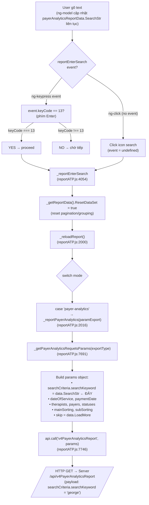

# Search Workflow — Payer Analytics Report

## Trigger Points (HTML)

```html
<!-- TRIGGER 1: Nhấn phím bất kỳ trên input -->
<input ng-keypress="reportEnterSearch($event);"
       ng-model="payerAnalyticsReportData.SearchStr" />

<!-- TRIGGER 2: Click icon search -->
<div ng-click="reportEnterSearch();">
  <i class="fas fa-search"></i>
</div>
```

---

## Full Call Chain



---

## Key Points

| Bước | File | Dòng | Ghi chú |
|------|------|------|---------|
| HTML input bind | `payerAnalyticsReportPTE.html` | — | `ng-model` cập nhật `payerAnalyticsReportData.SearchStr` realtime (**chưa** gọi API) |
| HTML keypress | `payerAnalyticsReportPTE.html` | — | `ng-keypress="reportEnterSearch($event)"` chỉ trigger khi nhấn Enter (`keyCode=13`) |
| HTML click | `payerAnalyticsReportPTE.html` | — | `ng-click="reportEnterSearch()"` gọi **không** truyền `event` |
| Entry point | `reportATP.js` | 4054 | `_reportEnterSearch(event)`: gate-check keyCode hoặc no-event → `_reloadReport()` |
| Router | `reportATP.js` | 2000 | `_reloadReport()`: dispatch theo `$scope.mode` |
| Payer Analytics dispatcher | `reportATP.js` | 2016 | `case 'payer-analytics'` → `_reportPayerAnalytics()` |
| Build request | `reportATP.js` | 7691 | `_getPayerAnalyticsRequetsParams()`: đọc `data.SearchStr` → gán vào `searchCriteria.searchKeyword` |
| Send to server | `reportATP.js` | 7746 | `api.call('v4PayerAnalyticsReport', params)` |

---

## Lưu ý quan trọng

> **`ng-model` không trigger API call.** `payerAnalyticsReportData.SearchStr` chỉ là two-way binding lưu giá trị. API chỉ được gọi khi user nhấn **Enter** hoặc click **icon search**.

> **`ResetDataSet = true`** ở `_reportEnterSearch` đảm bảo kết quả mới sẽ overwrite toàn bộ data cũ (không append kiểu LoadMore).

> **`_getReportData()`** với `mode = 'payer-analytics'` trả về `$scope.payerAnalyticsReportData` — đây là object duy nhất chứa `SearchStr`, `Apply.filter`, sorting, pagination.
