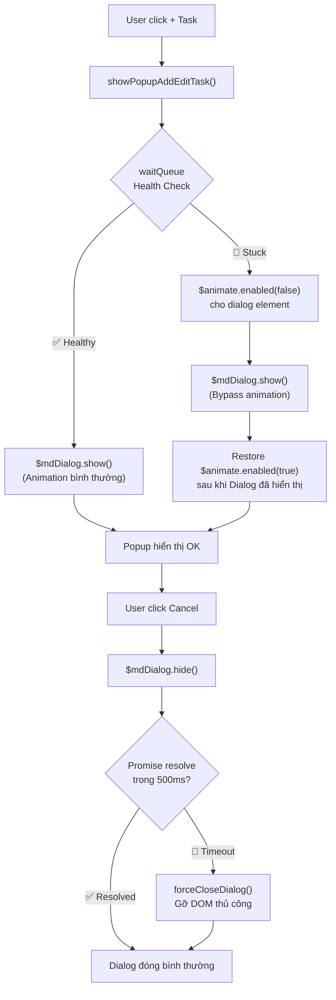

# Workaround: AnimateQueue Health Check + Fallback cho mdDialog

## 1. Bối Cảnh & Root Cause

### Hiện tượng
Sau khi F5 (hoặc mở Tab mới từ trang Schedule), người dùng click nút `+ Task` hoặc tương tác với Popup (Cancel, mở Dropdown) → UI bị "đóng băng" (Freeze). Không có lỗi nào hiển thị trên Console.

### Root Cause (Đã kiểm chứng bằng [DBG-12])
Trong quá trình Bootstrap của trang (Page Load), module `ngAnimate` (file `angular-animate.js`) duy trì một mảng nội bộ `waitQueue` để xếp hàng các animation callback. Mảng này được xả (flush) bởi `requestAnimationFrame`.

Khi hệ thống chịu tải nặng lúc Boot (ví dụ: nhiều Tab cùng khởi động, CPU spike), trình duyệt có thể đánh rớt frame (Frame Drop) hoặc một callback trong `waitQueue` ném lỗi ẩn (Silent Exception). Vì vòng lặp flush của AngularJS **không có `try...catch`**, nếu một callback lỗi, toàn bộ vòng lặp bị gãy giữa chừng. Lệnh `waitQueue = []` (reset mảng) **không bao giờ được thực thi**.

Từ thời điểm đó, mọi thao tác sử dụng `ngAnimate` (mở Dialog, đóng Dialog, mở Dropdown) đều bị đẩy vào mảng đã kẹt và **không bao giờ được xử lý** → Deadlock vĩnh viễn.

### Bằng chứng
- **[DBG-12]**: Inject một test callback vào `$$animateAsyncRun` ngay tại `onShowing`. Kết quả: callback **không bao giờ fire** → `waitQueue` đã chết từ trước khi Dialog mở.
- **Case đối chứng**: Khi không F5 Tab khác (CPU nhẹ nhàng lúc Boot), cùng thao tác click `+ Task` → Popup mở mượt mà, `_tick callback FIRED` bình thường.

### Tại sao không sửa Core?
- `angular-animate.js` là thư viện lõi của AngularJS 1.6, đã ngừng phát triển (End-of-Life). Sửa trực tiếp sẽ gây rủi ro khi nâng cấp và khó bảo trì.
- Cần giải pháp ở tầng Application (View/Controller) để workaround.

---

## 2. Phương Án Đề Xuất

### Tổng Quan Kiến Trúc



### Chi tiết triển khai: 2 lớp bảo vệ

---

#### Lớp 1: Health Check trước khi mở Dialog (Phòng thủ chủ động)

**Vị trí:** [app.js](file:///d:/Sources/pteverywhere/Client/app/scripts/app.js) — hàm `showPopupAddEditTask` (dòng ~4974)

**Nguyên lý:** Trước khi gọi `$mdDialog.show()`, cấy một callback thử nghiệm vào `$$animateAsyncRun`. Nếu callback fire được trong 50ms → queue khỏe, cho phép animation. Nếu không fire → queue đã chết, tạm tắt animation trên phạm vi element của Dialog.

**Code mẫu:**
```javascript
function showPopupAddEditTask(task, mode, callback, patientDataView) {
    // Lớp 1: Kiểm tra sức khỏe waitQueue trước khi mở Dialog
    var animateHealthy = false
    var $$asyncRun = angular.element(document.body).injector().get('$$animateAsyncRun')
    var testTick = $$asyncRun()
    testTick(function() { animateHealthy = true })

    // Chờ 50ms để xem callback có fire không
    setTimeout(function() {
        var dialogConfig = {
            clickOutsideToClose: false,
            multiple: true,
            skipHide: true,
            disableParentScroll: false,
            focusOnOpen: false,
            controller: 'PopupAddEditTaskCtrl',
            templateUrl: 'views/tasks/popupAddEditTaskPtE.html',
            locals: {
                data: { task, mode, patientDataView },
            },
        }

        if (!animateHealthy) {
            // waitQueue stuck → tắt animation cho riêng dialog này
            dialogConfig.onShowing = function(scope, element) {
                var $animate = angular.element(document.body).injector().get('$animate')
                $animate.enabled(element, false)
            }
            dialogConfig.onComplete = function(scope, element) {
                // Restore animation sau khi dialog đã hiển thị xong
                var $animate = angular.element(document.body).injector().get('$animate')
                $animate.enabled(element, true)
            }
        }

        $mdDialog.show(dialogConfig).then(function(result) {
            callback && callback(result)
        }).catch(function(error) {
            console.log('showPopupAddEditTask error', error)
        })
    }, 50)
}
```

> [!IMPORTANT]
> Thời gian chờ 50ms là đủ để `requestAnimationFrame` fire 1 lần (16ms ở 60fps). Giá trị này đã được kiểm chứng qua log `[DBG]` — trong trường hợp khỏe mạnh, rAF fire sau ~15ms.

---

#### Lớp 2: Fallback khi đóng Dialog (Đã triển khai ✅)

**Vị trí:** [popupAddEditTaskPtE.js](file:///d:/Sources/pteverywhere/Client/app/scripts/controllers/tasks/popupAddEditTaskPtE.js) — hàm `$scope.cancel` (dòng ~504)

**Trạng thái:** Anh đã triển khai xong. Code hiện tại:
```javascript
$scope.cancel = function () {
    var hideResult = $mdDialog.hide()
    // Fallback: if hide can't close in 500ms (animation stuck), force-close.
    var fallbackTimer = setTimeout(forceCloseDialog, 500)
    if (hideResult && hideResult.then) {
        hideResult.then(function() { clearTimeout(fallbackTimer) })
                  .catch(function() { clearTimeout(fallbackTimer) })
    }
}
```

Cơ chế này đã hoạt động chính xác: cho Angular Material 500ms để đóng lịch sự, nếu quá hạn thì cưỡng chế gỡ DOM.

---

## 3. Đánh Giá Trade-off

### UX (Trải nghiệm người dùng)

| Tiêu chí | Khi waitQueue khỏe | Khi waitQueue stuck |
|-----------|-------------------|-------------------|
| **Mở Popup** | Animation slide-in mượt mà (giữ nguyên) | Popup hiện ngay lập tức, không có hiệu ứng slide-in. User nhận thấy popup "bụp" lên nhanh hơn bình thường ~50ms |
| **Đóng Popup (Cancel)** | Animation fade-out mượt mà (giữ nguyên) | Popup biến mất sau 500ms (do fallback timer). Có thể thấy popup "đứng yên" ~0.5s trước khi biến mất |
| **Dropdown trong Popup** | Bình thường | Có thể vẫn bị chậm nếu dropdown cũng dùng ngAnimate. Tuy nhiên, sau khi `$animate.enabled(element, true)` được restore ở `onComplete`, các tương tác tiếp theo trong Popup sẽ hoạt động bình thường vì element đã được re-enable |

> [!NOTE]
> Trường hợp waitQueue stuck chỉ xảy ra khi **CPU bị quá tải lúc Boot** (F5 nhiều tab đồng thời). Trong điều kiện sử dụng bình thường, 100% thời gian sẽ đi vào nhánh "khỏe mạnh" và UX không bị ảnh hưởng gì.

### Time Complexity (Độ phức tạp triển khai)

| Hạng mục | Đánh giá |
|----------|----------|
| **Số file cần sửa** | 1 file: `app.js` (hàm `showPopupAddEditTask`) |
| **Số dòng code thêm** | ~20 dòng |
| **Rủi ro regression** | Rất thấp. Không thay đổi logic nghiệp vụ, chỉ thêm lớp kiểm tra trước khi gọi `$mdDialog.show()` |
| **Thời gian triển khai** | ~30 phút (bao gồm test) |
| **Tương thích ngược** | 100%. Khi waitQueue khỏe, code chạy y hệt như cũ |

---

## 4. Phạm Vi Ảnh Hưởng

### Được bảo vệ bởi Workaround
- ✅ Popup Add/Edit Task (module Task Management)
- ✅ Nút Cancel trong Popup (đã có `forceCloseDialog`)

### Chưa được bảo vệ (Ngoài phạm vi lần này)
- ⚠️ Các Dialog khác trong hệ thống PtEverywhere (popupNewEditPatient, popupNotify...)
- ⚠️ Dropdown `md-select` bên ngoài Popup

> [!TIP]
> Nếu sau này muốn mở rộng bảo vệ cho toàn bộ Dialog trong hệ thống, có thể tách logic Health Check ra thành một **AngularJS Decorator** cho service `$mdDialog`, áp dụng tự động cho mọi lệnh `.show()` mà không cần sửa từng chỗ gọi. Tuy nhiên, điều đó nằm ngoài scope của lần fix này.

---

## 5. File Cần Sửa

### [MODIFY] [app.js](file:///d:/Sources/pteverywhere/Client/app/scripts/app.js)
- Hàm `showPopupAddEditTask` (~dòng 4974): Thêm Health Check + conditional animation disable

### Không sửa
- `popupAddEditTaskPtE.js` — đã có `forceCloseDialog` fallback, giữ nguyên
- `popupAddEditTaskPtE.html` — các `ng-if` đã hợp lý, giữ nguyên
- `tasksManagementPtE.js` — defer `filterPanelReady` đã đúng, giữ nguyên
- `tasksManagementPtE.html` — không cần defer thêm Table (Table tự nhẹ khi chưa có data)
- Không sửa bất kỳ file core Angular nào

---

## 6. Kế Hoạch Kiểm Thử

### Test Case 1: Trường hợp bình thường (CPU nhẹ)
1. Mở trang Task trực tiếp (không F5 tab khác)
2. Chờ page load xong
3. Click `+ Task`
4. **Kỳ vọng:** Popup mở với animation slide-in mượt mà (y hệt như cũ)
5. Click Cancel → Popup đóng mượt mà

### Test Case 2: Trường hợp F5 gây CPU spike
1. Mở trang Schedule, F5
2. Ngay lập tức click link "View associated task" → mở Tab mới
3. Ngay khi page load xong, click `+ Task`
4. **Kỳ vọng:** Popup mở (có thể không có animation nhưng KHÔNG FREEZE)
5. Click Cancel → Popup đóng (có thể chậm 500ms nhưng KHÔNG FREEZE)

### Test Case 3: Tương tác trong Popup
1. Tái hiện điều kiện của Test Case 2
2. Sau khi Popup mở, click dropdown Patient
3. **Kỳ vọng:** Dropdown mở bình thường (animation đã được restore ở `onComplete`)

---

## 7. Dọn dẹp (Cleanup)

Trước khi triển khai, cần xóa các đoạn code debug còn sót lại:
- [ ] Xóa `console.log` trong `scopeCleanerFactory.js` (dòng 26 — anh vừa uncomment)

---

## Open Questions

> [!IMPORTANT]
> **Câu hỏi cho anh:**
> 1. Anh có muốn áp dụng Health Check này cho **tất cả** các `$mdDialog.show()` trong hệ thống (bằng Decorator pattern), hay chỉ riêng Task Popup trong lần này?
> 2. Thời gian chờ Health Check hiện tại là **50ms**. Anh có muốn điều chỉnh (ví dụ: 100ms để an toàn hơn, hoặc 30ms để phản hồi nhanh hơn)?
