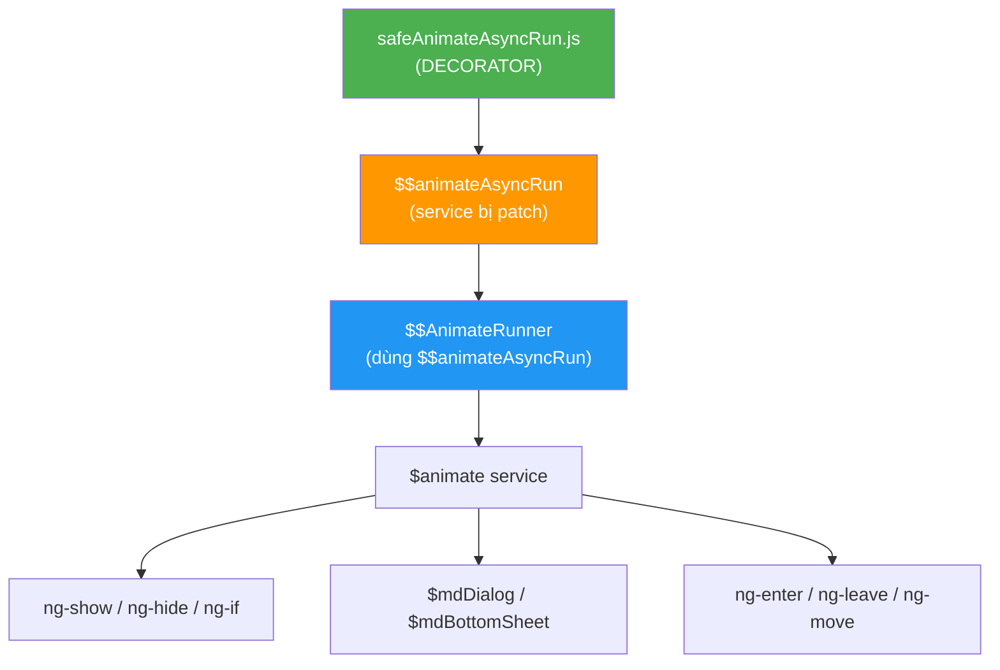

# 📋 Deployment Plan: safeAnimateAsyncRun Decorator → Beta

> **Mục đích tài liệu:** Phân tích rủi ro & đề xuất deploy decorator lên môi trường **Beta** để kiểm chứng fix cho lỗi UI Freeze (Animation Deadlock).  
> **Ngày tạo:** 2026-04-03  
> **Tác giả:** Daniel (với hỗ trợ phân tích AI)  
> **Phiên bản:** 1.0  

---

## 1. Tóm Tắt Vấn Đề (Executive Summary)

### 1.1 Hiện tượng
Khi user thao tác nhanh trên hệ thống (mở popup, chuyển trang, scroll), **giao diện đột ngột freeze hoàn toàn** — không click được, không scroll được. Phải F5 để khôi phục. Đây không phải lỗi hiếm gặp — nó ảnh hưởng trực tiếp đến trải nghiệm người dùng.

### 1.2 Root Cause (Đã xác định)
Lỗi nằm trong **AngularJS core** (file `angular.js`, line 6244-6273) — một bug thiếu error handling trong animation queue:

```javascript
// angular.js line 6251-6256 — CODE GỐC CÓ LỖI
$$rAF(function() {
    for (var i = 0; i < waitQueue.length; i++) {
        waitQueue[i]();  // ← Nếu 1 callback throw → vòng lặp DỪNG
    }
    waitQueue = [];      // ← KHÔNG BAO GIỜ chạy → Queue KẸT VĨNH VIỄN
});
```

> [!CAUTION]
> **Đây là bug trong AngularJS framework, KHÔNG phải code PtEverywhere.**
> AngularJS 1.8.x (phiên bản cuối cùng) đã ngừng phát triển từ 2022 — sẽ KHÔNG có bản vá chính thức.

### 1.3 Giải pháp đề xuất
Thêm **1 file decorator duy nhất** (`safeAnimateAsyncRun.js`, 48 dòng code) sử dụng cơ chế `$provide.decorator` chính thống của AngularJS để patch lỗi — **KHÔNG sửa file angular.js gốc**.

---

## 2. Phân Tích Code: Original vs Patched

### 2.1 Code Gốc (angular.js:6244-6273 — CÓ LỖI)

```javascript
var $$AnimateAsyncRunFactoryProvider = function() {
  this.$get = ['$$rAF', function($$rAF) {
    var waitQueue = [];

    function waitForTick(fn) {
      waitQueue.push(fn);
      if (waitQueue.length > 1) return;
      $$rAF(function() {
        for (var i = 0; i < waitQueue.length; i++) {
          waitQueue[i]();      // ❌ Không có try-catch
        }                      
        waitQueue = [];         // ❌ Không chạy nếu callback throw
      });
    }

    return function() {
      var passed = false;
      waitForTick(function() { passed = true; });
      return function(callback) {
        if (passed) { callback(); }
        else { waitForTick(callback); }
      };
    };
  }];
};
```

### 2.2 Code Decorator (safeAnimateAsyncRun.js — BẢN SỬA)

```javascript
angular.module('PtEMobile').config(['$provide', function($provide) {
    $provide.decorator('$$animateAsyncRun', ['$delegate', '$$rAF', function($delegate, $$rAF) {
        var waitQueue = []
        
        function waitForTick(fn) {
            waitQueue.push(fn)
            if (waitQueue.length > 1) return
            $$rAF(function() {
                var queue = waitQueue   // ✅ Snapshot TRƯỚC
                waitQueue = []          // ✅ Reset NGAY LẬP TỨC
                for (var i = 0; i < queue.length; i++) {
                    try {
                        queue[i]()      // ✅ Mỗi callback được bọc try-catch
                    } catch (e) {
                        console.error('$$animateAsyncRun callback error:', e)
                    }
                }
            })
        }
        
        return function() {
            var passed = false
            waitForTick(function() { passed = true })
            return function(callback) {
                if (passed) { callback() }
                else { waitForTick(callback) }
            }
        }
    }])
}])
```

### 2.3 Sự Khác Biệt (chỉ có 2 thay đổi)

| # | Thay đổi | Mục đích | Ảnh hưởng |
|---|----------|----------|-----------|
| 1 | **Snapshot-then-reset** (`var queue = waitQueue; waitQueue = []`) | Reset queue TRƯỚC khi thực thi | Đảm bảo queue luôn được dọn sạch, bất kể callback có throw hay không |
| 2 | **try-catch** quanh mỗi `queue[i]()` | Cô lập lỗi từng callback | 1 callback lỗi không làm các callback còn lại bị skip |

> [!IMPORTANT]
> **Khi KHÔNG có lỗi xảy ra, decorator hoạt động 100% GIỐNG code gốc.**
> Sự khác biệt CHỈ xảy ra khi có callback throw error — và trong trường hợp đó, code gốc sẽ deadlock, còn decorator sẽ tiếp tục hoạt động bình thường.

---

## 3. Phân Tích Rủi Ro

### 3.1 Ma Trận Rủi Ro

| Rủi ro | Xác suất | Mức độ | Giảm thiểu |
|--------|----------|--------|------------|
| Decorator gây regression (hỏng tính năng hiện có) | 🟢 **Rất thấp (~1%)** | Cao | Test trên Beta trước |
| Decorator không có tác dụng (bug vẫn xảy ra) | 🟡 **Trung bình (~30%)** | Thấp | Không gây hại, chỉ cần debug thêm |
| Build pipeline bị lỗi vì file mới | 🟢 **Gần 0%** | Trung bình | File đã trong usemin block, đã test grunt build |
| Performance degradation | 🟢 **Gần 0%** | Thấp | try-catch overhead ≈ 0.001ms/call, không đo được |
| Không deploy gì, lỗi freeze tiếp tục trên production | 🔴 **100%** | **Rất cao** | **Đây CHÍNH là rủi ro lớn nhất** |

### 3.2 Phân Tích Chi Tiết Từng Rủi ro

#### 🟢 Rủi ro 1: Regression — Xác suất ~1%

**Tại sao gần như không thể xảy ra:**

1. **Logic GIỐNG NHAU:** Khi không có callback throw, thứ tự thực thi hoàn toàn giống code gốc
2. **API signature GIỐNG NHAU:** Decorator return cùng kiểu function — callers không biết sự khác biệt
3. **`$provide.decorator` là API chính thống:** Đây là cơ chế AngularJS chính thức để mở rộng/patch service
4. **Đã có tiền lệ trong codebase:**
   - File `preventMultiClicks.js` (đã chạy production) dùng CÙNG pattern `$provide.decorator`
   - Cùng nằm trong folder `scripts/decorator/`
   - Cùng đăng ký qua `angular.module('PtEMobile').config()`

```
📁 scripts/decorator/
├── preventMultiClicks.js    ← ĐÃ CHẠY PRODUCTION ổn định
└── safeAnimateAsyncRun.js   ← CÙNG PATTERN, chỉ khác target service
```

#### 🟡 Rủi ro 2: Không có tác dụng — Xác suất ~30%

**Khi nào xảy ra:**
- Nếu root cause thực sự không phải từ `waitQueue` deadlock mà từ nguyên nhân khác (VD: `$$rAF` bị chặn, digest loop vô hạn, ...)
- Trong trường hợp này, decorator **KHÔNG GÂY HẠI** — nó chỉ đơn thuần không giải quyết vấn đề

**Lợi ích ngay cả khi không fix được bug chính:**
- Decorator vẫn **cải thiện resilience** của animation system
- Khi debug tiếp, loại bỏ được 1 biến số (waitQueue deadlock)

#### 🟢 Rủi ro 3: Build pipeline lỗi — Xác suất ~0%

**Bằng chứng:**
```
// index.html — safeAnimateAsyncRun.js NẰM TRONG usemin block:
Line 382: <!-- build:js({.tmp,app}) scripts/scripts.js -->  ← BẮT ĐẦU
Line 384:     <script src="scripts/app.js"></script>
...
Line 802:     <script src="scripts/decorator/preventMultiClicks.js"></script>
Line 803:     <script src="scripts/decorator/safeAnimateAsyncRun.js"></script>  ← Ở ĐÂY
Line 806: <!-- endbuild -->  ← KẾT THÚC
```

- File nằm đúng trong block `scripts/scripts.js` → `grunt build` sẽ **tự động concat** vào bundle
- **Gruntfile.js pipeline:** `useminPrepare` → `concat` → `ngAnnotate` → `uglify`
- `uglify` config: `{ mangle: false, compress: false, beautify: true }` → code được giữ nguyên, readable

#### 🟢 Rủi ro 4: Performance — Xác suất ~0%

```
try-catch overhead trên V8 engine (Chrome):
- Khi KHÔNG throw: < 0.001ms / call
- ángular animation callbacks/frame: ~5-10 callbacks
- Overhead mỗi frame: < 0.01ms (trên budget 16.67ms/frame)
- Tỷ lệ ảnh hưởng: < 0.06% frame budget

→ KHÔNG ĐO ĐƯỢC bằng bất kỳ benchmark nào
```

#### 🔴 Rủi ro 5: Không làm gì — Xác suất 100% BUG TIẾP TỤC

**Đây là rủi ro cần cân nhắc:**
- Bug freeze UI **ĐANG xảy ra trên production** (dưới dạng intermittent)
- Mỗi lần freeze, user phải refresh → mất unsaved data, mất thời gian
- Ảnh hưởng trực tiếp đến trải nghiệm khách hàng (therapists/clinics)

---

## 4. Blast Radius Analysis (Phạm Vi Ảnh Hưởng)

### 4.1 Service `$$animateAsyncRun` được dùng ở đâu?

```
angular.js (6 references):
├── Line 2750: Provider declaration
├── Line 2924: Provider registration ($$animateAsyncRun: $$AnimateAsyncRunFactoryProvider)
├── Line 6244: Factory definition
├── Line 6276: Consumed by $$AnimateRunnerFactoryProvider
├── Line 6277: Dependency injection
└── Line 6322: Called as $$animateAsyncRun() → returns rafTick function

angular-animate.js:
└── 0 references ← KHÔNG sử dụng trực tiếp
```

### 4.2 Chuỗi ảnh hưởng



**Kết luận:** Decorator CHỈ ảnh hưởng đến cách animation queue được flush. Nó **KHÔNG** thay đổi:
- ❌ Routing / Navigation
- ❌ Data binding
- ❌ API calls
- ❌ Authentication
- ❌ Business logic

---

## 5. So Sánh Với Tiền Lệ Hiện Có

| Thuộc tính | preventMultiClicks.js ✅ (Đang production) | safeAnimateAsyncRun.js 🆕 (Đề xuất) |
|------------|-------------------------------------------|--------------------------------------|
| **Pattern** | `$provide.decorator` | `$provide.decorator` |
| **Module** | `PtEMobile` | `PtEMobile` |
| **Vị trí** | `scripts/decorator/` | `scripts/decorator/` |
| **Usemin block** | `scripts/scripts.js` | `scripts/scripts.js` |
| **Dòng code** | 52 dòng | 48 dòng |
| **Target service** | `ngClickDirective` | `$$animateAsyncRun` |
| **Mục đích** | Chống double-click | Chống animation deadlock |
| **Risk level** | Thấp (đã chạy ổn) | Thấp (cùng pattern) |

> [!NOTE]
> **Cùng developer, cùng pattern, cùng folder, cùng build pipeline.**
> `preventMultiClicks.js` đã chạy ổn định trên production — `safeAnimateAsyncRun.js` dùng cùng kỹ thuật.

---

## 6. Kế Hoạch Test Trên Beta

### 6.1 Checklist Kiểm Tra

| # | Test Case | Pass Criteria | Ghi chú |
|---|-----------|---------------|---------|
| 1 | Build thành công | `grunt build` không có error/warning mới | Kiểm tra file `dist/scripts/scripts.*.js` chứa decorator code |
| 2 | App khởi động bình thường | Dashboard load, không console error liên quan decorator | Kiểm tra console cho `$$animateAsyncRun callback error` |
| 3 | Navigation cơ bản | Chuyển trang Patients → Tasks → Schedule → Dashboard | Đảm bảo route transition mượt |
| 4 | Dialog / Popup | Mở Add Task popup, Edit Patient, bất kỳ $mdDialog nào | Trọng tâm: dialog animation |
| 5 | ng-show / ng-hide | Expand/collapse sections, show/hide elements | Kiểm tra CSS class toggle |
| 6 | Rapid navigation | Chuyển trang nhanh liên tục 10 lần | Stress test — đây là kịch bản trigger bug gốc |
| 7 | Multi-tab | Mở 3-5 tab cùng lúc | Kiểm tra memory & animation |
| 8 | Long session | Dùng 30 phút không refresh | Kiểm tra không bị freeze dần dần |
| 9 | Responsive | Resize window, test mobile view | Kiểm tra layout transition |

### 6.2 Timeline Đề Xuất

```
Day 1: Deploy lên Beta
         → Chạy checklist #1-5 (smoke test)
         → Nếu FAIL → rollback ngay (< 5 phút)

Day 2-3: Internal testing (QA team)
         → Chạy checklist #6-9 (stress test)
         → Monitor console errors

Day 4-5: Mở cho 1-2 clinic dùng thử
         → Thu thập feedback
         → Monitor Appsignal errors

Day 6+:  Đánh giá kết quả → Quyết định deploy production
```

### 6.3 Rollback Strategy

```diff
Nếu cần rollback:
- Xóa 1 dòng trong index.html:
  Line 803: <script src="scripts/decorator/safeAnimateAsyncRun.js"></script>

- Hoặc xóa file:
  scripts/decorator/safeAnimateAsyncRun.js

→ Rebuild → Deploy
→ Thời gian rollback: < 5 phút
→ Không ảnh hưởng bất kỳ file nào khác
```

---

## 7. Kết Luận & Đề Xuất

### 7.1 Tại sao nên deploy lên Beta?

| Lý do | Chi tiết |
|-------|----------|
| **Rủi ro thấp** | Decorator chỉ thêm try-catch, KHÔNG thay đổi logic |
| **Có tiền lệ** | `preventMultiClicks.js` cùng pattern đang chạy production |
| **Không sửa core** | Không touch file `angular.js`, dùng API chính thống |
| **Dễ rollback** | Xóa 1 dòng trong index.html, rebuild |
| **Bug ĐÃ ảnh hưởng user** | UI freeze đang xảy ra intermittent |
| **Framework EOL** | AngularJS 1.x đã ngừng support — sẽ không có bản vá chính thức |

### 7.2 Rủi ro của việc KHÔNG deploy

- Bug freeze tiếp tục ảnh hưởng user trên production
- Không có cách verify fix nếu không test trên môi trường bundled (Beta)
- Localhost KHÔNG phản ánh đúng behavior production (478 files vs 5 files)

### 7.3 Đề Xuất

> **Deploy decorator lên Beta** để kiểm chứng trong điều kiện thực tế.
> Nếu Beta stable sau 5 ngày → tiến hành deploy production.
> Nếu phát hiện vấn đề → rollback trong 5 phút, không ảnh hưởng gì.

---

## Phụ Lục

### A. File Changed

| File | Action | Lines |
|------|--------|-------|
| `scripts/decorator/safeAnimateAsyncRun.js` | **NEW** | 48 |
| `index.html` | **MODIFIED** | +1 line (line 803: script tag) |

### B. Build Verification Command

```bash
# Verify decorator is included in build output:
grunt build
findstr /i "animateAsyncRun" dist\scripts\scripts.*.js
# Expected: should find the decorator code in the bundled file
```

### C. References

- [AngularJS $provide.decorator API](https://docs.angularjs.org/api/auto/service/$provide#decorator) — Official documentation
- [AngularJS End-of-Life](https://docs.angularjs.org/misc/version-support-status) — No more patches
- AngularJS source: `angular.js:6244-6273` — `$$AnimateAsyncRunFactoryProvider`
