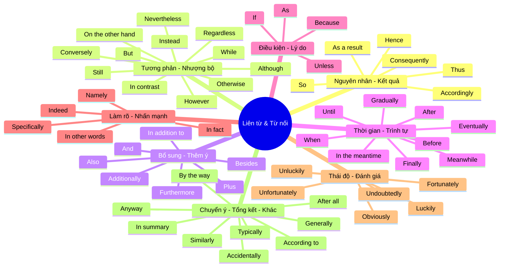

# Phân loại Liên từ & Từ nối (Conjunctions & Linking Words)

Dưới đây là danh sách các liên từ và trạng từ liên kết được gom nhóm theo ý nghĩa và chức năng, giúp bạn dễ dàng ghi nhớ và sử dụng đúng ngữ cảnh.

## 🗺️ Sơ đồ tư duy (Mindmap)

---

## 📝 Danh sách chi tiết từng nhóm

### 1. Nguyên nhân & Kết quả (Vì thế, Do đó)
*Nhóm này dùng để chỉ ra kết quả của một hành động hoặc sự việc.*
- **Accordingly**: Một cách phù hợp, theo đó.
- **As a result**: Kết quả là.
- **Consequently**: Hậu quả là, do đó.
- **Hence**: Do đó, vì thế.
- **So**: Vì vậy.
- **Thus**: Như vậy, do đó.

### 2. Tương phản & Nhượng bộ (Tuy nhiên, Mặc dù)
*Dùng để thể hiện sự đối lập giữa hai ý tưởng hoặc sự việc.*
- **Although**: Mặc dù.
- **But**: Nhưng.
- **Conversely**: Ngược lại.
- **However**: Tuy nhiên.
- **In contrast**: Trái lại.
- **Instead**: Thay vì, thay vào đó.
- **Nevertheless**: Tuy nhiên, dẫu vậy.
- **On the other hand**: Mặt khác.
- **Otherwise**: Nếu không thì.
- **Regardless**: Bất kể, không quan tâm.
- **Still**: Vẫn, tuy nhiên.
- **While**: Trong khi (thường mang ý so sánh đối lập).

### 3. Bổ sung ý (Thêm vào đó, Ngoài ra)
*Dùng để thêm thông tin hoặc củng cố ý tưởng trước đó.*
- **Additionally**: Thêm vào đó.
- **Also**: Cũng.
- **And**: Và.
- **Besides**: Ngoài ra.
- **Furthermore**: Hơn nữa.
- **In addition to**: Ngoài ra (kèm theo danh từ).
- **Plus**: Thêm vào đó, cộng với.

### 4. Thời gian & Trình tự (Khi nào, Sau đó)
*Dùng để sắp xếp các sự kiện theo thứ tự hoặc thời gian.*
- **After**: Sau khi.
- **Before**: Trước khi.
- **Eventually**: Cuối cùng thì.
- **Finally**: Cuối cùng (kết thúc một chuỗi).
- **Gradually**: Dần dần.
- **In the meantime**: Trong lúc đó.
- **Meanwhile**: Trong khi đó.
- **Until**: Cho đến khi.
- **When**: Khi.

### 5. Điều kiện & Lý do (Bởi vì, Nếu)
*Thể hiện nguyên nhân hoặc điều kiện để sự việc xảy ra.*
- **As**: Bởi vì / Khi.
- **Because**: Bởi vì.
- **If**: Nếu.
- **Unless**: Trừ khi.

### 6. Làm rõ & Nhấn mạnh (Cụ thể là, Thực tế là)
*Dùng để giải thích rõ hơn hoặc nhấn mạnh một điểm.*
- **In fact**: Thực tế là.
- **In other words**: Nói cách khác.
- **Indeed**: Thực sự, quả thật.
- **Namely**: Cụ thể là.
- **Specifically**: Đặc biệt là, một cách cụ thể.

### 7. Đánh giá & Thái độ (May mắn, Rõ ràng)
*Thể hiện thái độ của người nói đối với sự việc.*
- **Fortunately**: May mắn thay.
- **Luckily**: May mắn thay.
- **Unfortunately**: Thật không may.
- **Unluckily**: Thật không may.
- **Obviously**: Rõ ràng là.
- **Undoubtedly**: Chắc chắn, không còn nghi ngờ gì nữa.

### 8. Chuyển ý, Tổng kết & Các trường hợp khác
- **Accidentally**: Tình cờ, vô tình.
- **According to**: Theo như.
- **After all**: Rốt cuộc thì.
- **Anyway**: Dù sao thì.
- **By the way**: Nhân tiện.
- **Generally**: Nói chung.
- **Typically**: Điển hình là.
- **In summary**: Tóm lại.
- **Similarly**: Tương tự như vậy.
