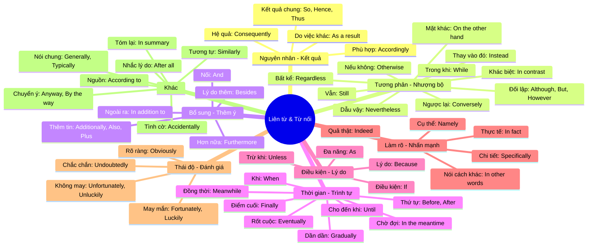

# Phân loại Liên từ & Từ nối (Conjunctions & Linking Words) - Phiên bản Chi tiết (v2)

Dưới đây là danh sách các liên từ và trạng từ liên kết được phân loại dựa trên sắc thái ý nghĩa và cách giải thích cụ thể trong từng ngữ cảnh.

## 🗺️ Sơ đồ tư duy (Mindmap)

---

## 📝 Danh sách chi tiết từng nhóm

### 1. Nguyên nhân & Kết quả (Cause & Effect)
- **Kết quả chung (Logical Result)**:
    - **So**: Vì vậy.
    - **Hence**: Vì thế, do đó.
    - **Thus**: Vì vậy, do đó.
    *(Dùng để chỉ kết quả của một việc hoặc những gì bạn vừa nói)*
- **Hệ quả (Consequence)**:
    - **Consequently**: Hậu quả là, do đó.
- **Sự việc xảy ra do việc khác (Outcome)**:
    - **As a result**: Kết quả là, hậu quả là.
    *(Dùng để nói điều gì đã xảy ra do một việc khác)*
- **Hành động phù hợp (Right action)**:
    - **Accordingly**: Một cách phù hợp, theo đó.
    *(Dùng để nói rằng một việc gì đó được thực hiện theo cách phù hợp với tình huống)*

### 2. Tương phản & Nhượng bộ (Contrast & Concession)
- **Sự đối lập/Trái ngược (Contrast)**:
    - **Although**: Mặc dù.
    - **But**: Nhưng.
    - **However**: Tuy nhiên.
    *(Dùng để chỉ sự tương phản hoặc kết nối hai ý tưởng trái ngược nhau)*
- **Sự việc vẫn xảy ra dù có cản trở (Concession)**:
    - **Nevertheless**: Tuy nhiên, dẫu vậy.
    *(Dùng để chỉ ra rằng một việc vẫn xảy ra mặc dù có một việc khác có thể ngăn cản nó)*
- **Ngược lại hoàn toàn (Opposite Idea)**:
    - **Conversely**: Ngược lại.
    *(Dùng để giới thiệu một ý tưởng trái ngược với những gì vừa mới được nói)*
- **Sự khác biệt (Difference)**:
    - **In contrast**: Trái lại.
    *(Dùng để chỉ ra rằng hai thứ rất khác nhau)*
- **Mặt khác (Different Perspective)**:
    - **On the other hand**: Mặt khác.
    *(Dùng để chỉ ra một quan điểm khác hoặc trái ngược)*
- **Thay thế (Substitution)**:
    - **Instead**: Thay vì, thay vào đó.
    *(Dùng để nói rằng một việc được làm thay cho một việc khác)*
- **Vẫn (Continuation)**:
    - **Still**: Vẫn, tuy nhiên.
    *(Dùng để nói rằng một tình huống vẫn tiếp tục tồn tại)*
- **Nếu không thì (Alternative Consequence)**:
    - **Otherwise**: Nếu không thì.
    *(Dùng để nói điều gì sẽ xảy ra nếu bạn không làm một việc gì đó)*
- **Bất chấp khó khăn (Persistence)**:
    - **Regardless**: Bất kể, không quan tâm.
    *(Dùng để làm một việc gì đó ngay cả khi có những vấn đề hoặc khó khăn)*
- **Hai việc cùng lúc (Simultaneous Contrast)**:
    - **While**: Trong khi.
    *(Dùng để nói về hai việc đang diễn ra cùng một lúc)*

### 3. Bổ sung ý (Addition)
- **Thêm thông tin chung (More info)**:
    - **Additionally**: Thêm vào đó.
    - **Also**: Cũng.
    - **Plus**: Thêm vào đó, cộng với.
- **Thêm một mẩu tin khác (Another piece)**:
    - **Furthermore**: Hơn nữa.
    *(Dùng để thêm một mẩu thông tin khác vào những gì bạn vừa nói)*
- **Thêm lý do/thông tin bổ trợ (Extra reason)**:
    - **Besides**: Ngoài ra.
    *(Dùng để thêm một lý do hoặc mẩu thông tin khác)*
- **Nối từ/câu (Joining)**:
    - **And**: Và.
    *(Dùng để nối hai từ hoặc hai câu lại với nhau)*
- **Giới từ bổ sung (Prepositional)**:
    - **In addition to**: Ngoài ra (kèm theo danh từ).

### 4. Thời gian & Trình tự (Time & Sequence)
- **Trước/Sau (Order)**:
    - **Before**: Trước khi.
    - **After**: Sau khi.
- **Điểm cuối/Kết thúc (End of process)**:
    - **Finally**: Cuối cùng.
    *(Dùng để giới thiệu ý cuối cùng hoặc sự kết thúc của một quá trình)*
- **Sau thời gian dài (After long time)**:
    - **Eventually**: Cuối cùng thì.
    *(Dùng để nói rằng một việc gì đó xảy ra sau một thời gian dài)*
- **Dần dần (Gradual)**:
    - **Gradually**: Dần dần.
    *(Dùng để nói về việc gì đó diễn ra từng chút một qua thời gian)*
- **Cùng lúc (Simultaneous)**:
    - **Meanwhile**: Trong khi đó.
    *(Dùng để nói về việc gì đó đang diễn ra cùng lúc với một việc khác)*
- **Thời gian chờ đợi (Between events)**:
    - **In the meantime**: Trong lúc đó.
    *(Dùng để nói về khoảng thời gian ở giữa hai sự kiện)*
- **Cho đến khi (Duration)**:
    - **Until**: Cho đến khi.
- **Khi (Specific time)**:
    - **When**: Khi.

### 5. Điều kiện & Lý do (Condition & Reason)
- **Lý do cụ thể (Reason)**:
    - **Because**: Bởi vì.
- **Đa năng (Time or Reason)**:
    - **As**: Bởi vì / Khi.
- **Điều kiện/Khả năng (Condition)**:
    - **If**: Nếu.
- **Điều kiện phủ định (Negative Condition)**:
    - **Unless**: Trừ khi.

### 6. Làm rõ & Nhấn mạnh (Clarification & Emphasis)
- **Nhấn mạnh sự thật (Truth)**:
    - **In fact**: Thực tế là.
- **Giải thích lại (Restatement)**:
    - **In other words**: Nói cách khác.
- **Xác nhận/Đồng ý (Agreement)**:
    - **Indeed**: Thực sự, quả thật.
- **Nêu tên cụ thể (Naming)**:
    - **Namely**: Cụ thể là.
- **Chi tiết cụ thể (Detail)**:
    - **Specifically**: Đặc biệt là, cụ thể là.

### 7. Thái độ & Đánh giá (Attitude & Assessment)
- **May mắn (Lucky occurrence)**:
    - **Fortunately**: May mắn thay.
    - **Luckily**: May mắn thay.
- **Không may (Unfortunate occurrence)**:
    - **Unfortunately**: Thật không may.
    - **Unluckily**: Thật không may.
- **Rõ ràng (Easy to see)**:
    - **Obviously**: Rõ ràng là.
- **Chắc chắn (No doubt)**:
    - **Undoubtedly**: Chắc chắn.

### 8. Các trường hợp khác
- **Chuyển ý/Quay lại chủ đề**:
    - **Anyway**: Dù sao thì.
    - **By the way**: Nhân tiện.
- **Nguồn thông tin**:
    - **According to**: Theo như.
- **Nhắc lại lý do quan trọng**:
    - **After all**: Rốt cuộc thì.
- **Nói chung/Thông thường**:
    - **Generally**: Nói chung.
    - **Typically**: Điển hình là.
- **Tóm tắt**:
    - **In summary**: Tóm lại.
- **Tương tự**:
    - **Similarly**: Tương tự như vậy.
- **Tình cờ/Vô ý**:
    - **Accidentally**: Tình cờ, vô tình.
